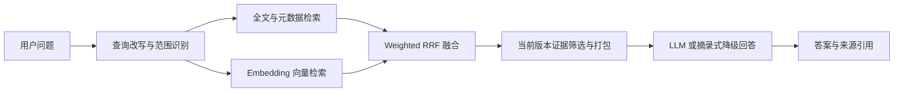

# AiWeb · 智知知识管理平台

智知是一个面向课程设计与本地部署的智能知识管理平台，提供知识库、文档管理、全文检索、RAG 问答、来源引用、共享审核和基础运营统计。

项目采用 Vue 3 + Express + MySQL。大语言模型与 Embedding 通过后端调用 OpenAI-compatible API；API Key 不会发送到前端，也不应提交到 Git。

## 主要功能

- 账号注册、登录与系统管理员、部门管理员、普通用户三级角色。
- 私有、团队共享、公共知识库及文档访问控制。
- PDF、DOCX、TXT、Markdown 上传、解析、分块与版本管理。
- 文本型 PDF 提取，以及 Poppler + Tesseract 扫描 PDF OCR。
- MySQL 全文检索、元数据精确匹配与向量检索融合。
- 在线 LLM 回答、证据引用和多轮会话。
- LLM 或 Embedding 不可用时的关键词检索与摘录回答降级。
- 文档收藏、点赞、评论、共享申请与管理员审核。
- 仪表盘、热门内容、搜索趋势和分类统计。
- 手机、平板与桌面端响应式页面。

## 技术栈

| 层级 | 技术 |
| --- | --- |
| 前端 | Vue 3、TypeScript、Vite |
| 后端 | Node.js 22、Express 5、TypeScript |
| 数据库 | MySQL 8.4、InnoDB、ngram FULLTEXT |
| 文档解析 | pdf-parse、Mammoth、Poppler、Tesseract |
| AI | OpenAI-compatible LLM API 与 Embedding API |
| 部署 | Docker Compose 或宿主机 Node.js |

## 系统架构

日常开发推荐让 Vue 与 Express 运行在宿主机，仅通过 Docker Compose 运行 MySQL：

```text
浏览器
  └─ Vue / Vite               127.0.0.1:5173
       └─ /api 代理到 Express 127.0.0.1:8000
            ├─ MySQL          127.0.0.1:3306
            ├─ LLM API
            ├─ Embedding API
            └─ data/          上传文件与 OCR 临时目录
```

- `compose.yaml`：MySQL 基础设施。
- `compose.production.yaml`：应用容器覆盖配置，与 `compose.yaml` 组合使用。
- `data/`、`.env`、`.env.docker`：仅保留在本机，不进入 Git。

## 快速开始

### 1. 安装依赖

需要 Node.js 22、Docker，以及可选的 PDF/OCR 工具。

macOS：

```bash
brew install node@22 poppler tesseract tesseract-lang
npm ci
```

Arch Linux：

```bash
sudo pacman -S nodejs npm poppler tesseract tesseract-data-chi_sim tesseract-data-eng
npm ci
```

### 2. 配置环境变量

复制示例文件并替换所有 `CHANGE_ME` 占位值：

```bash
cp .env.docker.example .env.docker
cp .env.example .env
```

如果 `.env.docker` 已配置完成，可以安全同步数据库和管理员配置到宿主机 `.env`：

```bash
npm run env:sync-native
```

同步脚本不会打印密钥，也不会修改数据库中的密码。真实配置文件不得提交或发送到前端。

核心配置包括：

- `DB_*`：MySQL 连接。
- `ADMIN_PASSWORD`：首次初始化的管理员密码。
- `LLM_API_*`：OpenAI-compatible 对话模型配置。
- `EMBEDDING_API_*`：向量模型、维度与重试配置。
- `PDF_OCR_*`：OCR 开关、语言、页数、DPI 和超时。
- `APP_DATA_DIR`：上传文件和运行数据目录。
- `ACCEPTANCE_MODE`：隔离验收数据库安全门禁，业务环境保持 `false`。

### 3. 启动开发环境

```bash
npm run infra:up
npm run dev
```

打开 <http://127.0.0.1:5173>。

也可以分别启动：

```bash
npm run dev:server
npm run dev:web
```

停止 MySQL 容器但保留数据卷：

```bash
npm run infra:down
```

## Docker 部署

Windows 可使用：

```powershell
.\start-docker.ps1
.\stop-docker.ps1
```

其他平台可组合两份 Compose 配置：

```bash
docker compose \
  -f compose.yaml \
  -f compose.production.yaml \
  --env-file .env.docker \
  up -d --build
```

应用与 MySQL 端口默认只绑定 `127.0.0.1`。应用容器将项目 `data/` 映射到 `/app/data`，可与宿主机开发模式共享上传文件。

停止服务时不要使用 `docker compose down -v`，否则会删除 MySQL 数据卷。

## RAG 数据流



检索阶段统一检查实时权限、知识库范围、文档 `ready` 状态和当前文档版本。证据保持相关度顺序，只合并同文档、同版本、同章节中的相邻分块。回答引用与实际送入模型的证据使用同一组稳定编号。

无相关证据时返回 `retrieval_insufficient`；模型回答缺乏证据支持时返回 `generation_unsupported` 并降级；云服务故障使用 `provider_failed` 标记。

## Embedding 与故障恢复

- 文档向量任务采用单 worker 串行队列并按文档去重。
- 仅补齐缺失、陈旧或版本不匹配的向量。
- 429、超时与 5xx 使用有限指数退避，并优先遵循 `Retry-After`。
- 健康检查中的通过条件是 `indexed === chunks` 且 `stale === 0`。

首次启用或更换 Embedding 模型时，应先停止文档写入，再执行：

```bash
npm run embedding:rebuild -- --confirm-write-stop
```

该操作只重建 `chunk_embeddings`，不会删除文档和文档分块；源数据在执行期间变化时会自动中止。

## OCR 行为

文本型 PDF 始终优先读取文本层。仅当 PDF 没有足够文本时，才使用 Poppler 渲染页面并调用 Tesseract OCR。

完整 Docker 镜像包含简体中文、英文和方向识别语言包。宿主机缺少 OCR 组件时，扫描 PDF 返回明确的 503 提示，普通文本型 PDF 仍可正常上传和解析。

## 权限与会话安全

- username、email、phone 会进行跨字段登录标识冲突检查。
- 搜索、统计、详情、下载、RAG 和会话均执行服务端权限校验。
- 知识库撤权后，绑定的历史会话从无权用户列表隐藏，详情和追问被拒绝。
- 重新授权后历史会话可以恢复，不会通过删除数据实现撤权。
- 前端新建会话、切换会话和退出登录会使旧问答请求失效，避免异步响应污染当前页面。

## 数据安全

- MySQL 数据卷：`aiweb_mysql-data`。
- 上传与 OCR 数据：项目 `data/`。
- 旧容器上传数据可通过 `npm run data:export-legacy` 只读导出。
- 不要删除 Docker volume、业务数据库或业务上传目录。
- 不要提交 `.env`、`.env.docker`、日志、数据库文件、上传文件或模型文件。

验收环境应设置 `ACCEPTANCE_MODE=true`，并使用以 `zhizhi_acceptance_` 开头的独立数据库名。数据库名不符合前缀时应用会拒绝启动，防止测试脚本写入业务数据库。

## 常用命令

```bash
npm run typecheck          # TypeScript 与 Vue 类型检查
npm run build              # 构建前端与后端
npm run infra:up           # 启动 MySQL
npm run infra:down         # 停止 MySQL，不删除 volume
npm run reindex:documents  # 重建文档全文索引
npm run reembed:documents  # 补齐文档向量
npm run embedding:rebuild  # 受保护的全量向量重建
```

## Git 安全说明

仓库通过 `.gitignore` 排除以下本地内容：

- `.env`、`.env.*` 中除示例文件以外的真实配置。
- `data/`、日志、PID、数据库和运行状态。
- `node_modules/`、前后端构建产物与测试报告。

提交前建议执行：

```bash
git status
npm run typecheck
npm run build
```

示例配置只能包含占位值，不得把真实 API Key、数据库密码或 GitHub Token 写入 README、源码或提交历史。
