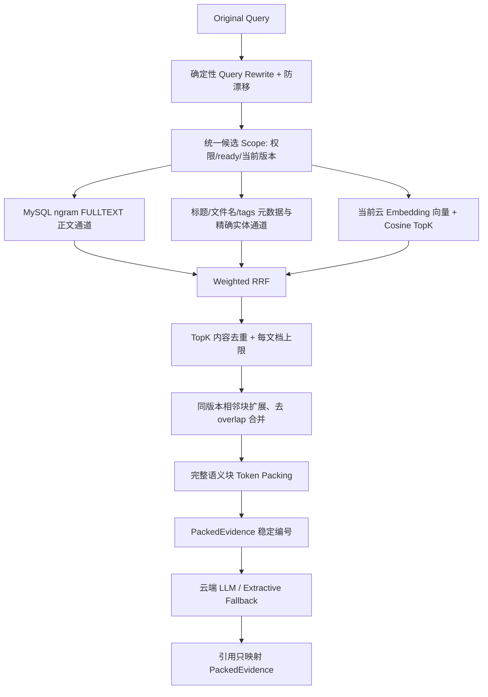

# AiWeb 智知知识库

本项目是一个 Vue + Express + MySQL 知识库系统，LLM 与 Embedding 使用后端 OpenAI-compatible API，支持账号与三级角色、文档上传和 OCR、混合检索、带引用问答、互动、共享审核及运营统计。

## 开发架构

日常开发时，Vue 与 Express 直接运行在宿主机；Docker Compose 只运行 MySQL：

```text
Vue (127.0.0.1:5173) -> Express (127.0.0.1:8000)
                              |-> MySQL (127.0.0.1:3306, Docker)
                              |-> 云端 LLM / Embedding API
                              `-> 项目 data/
```

`compose.yaml` 是日常开发配置。完整容器部署由 `compose.yaml` 与 `compose.production.yaml` 组合提供。

## macOS / Arch Linux 原生开发

需要 Node.js 22、Docker、Poppler、Tesseract，以及 Tesseract 的简体中文和英文语言包。

macOS（Homebrew）：

```bash
brew install node@22 poppler tesseract tesseract-lang
```

Arch Linux：

```bash
sudo pacman -S nodejs npm poppler tesseract tesseract-data-chi_sim tesseract-data-eng
```

首次配置时使用同步命令创建或更新宿主机 `.env`。它会保留其他配置，不打印密钥，只把现有 `.env.docker` 的数据库和管理员凭据同步到原生环境；不会修改数据库密码。

```bash
npm ci
npm run env:sync-native
npm run infra:up
npm run dev
```

浏览器打开 <http://127.0.0.1:5173>。Vue 通过 Vite 将 `/api` 代理到 Express；修改 Vue 文件会 HMR，修改服务端 TypeScript 会自动重启 Express。

单独启动后端或前端：

```bash
npm run dev:server
npm run dev:web
```

停止基础设施（不会删除卷）：

```bash
npm run infra:down
```

## 旧上传数据

旧容器部署的上传文件可能位于 `aiweb_app-data`。首次切换到宿主机开发前执行：

```bash
npm run data:export-legacy
```

该命令以只读方式挂载旧卷，仅把缺失文件复制到 `data/uploads/`，不会覆盖本地文件，也不会删除或修改旧卷。应用兼容数据库中已有的 `/app/data/...` 路径。

## MySQL 与索引数据安全

- MySQL 数据保存在 `aiweb_mysql-data`。
- 不要执行 `docker compose down -v`、`docker volume rm` 或任何清空数据库目录的命令。
- 日常启动不会重新初始化已有数据库。API Key 只放在后端 `.env` / `.env.docker`，不得提交或发送到前端。

快速检查：

```bash
docker compose --env-file .env.docker ps
```

## 完整 Docker 部署

Windows 一键脚本继续使用完整容器部署：

```powershell
.\start-docker.ps1
.\stop-docker.ps1
```

也可以手动组合配置：

```bash
docker compose -f compose.yaml -f compose.production.yaml --env-file .env.docker up -d --build
```

生产容器将项目 `data/` 绑定到 `/app/data`，因此与宿主机开发共享上传文件；Web 与 MySQL 端口只绑定到 `127.0.0.1`。

## 验证

```bash
npm run typecheck
npm run build
npm run test:unit
```

`test:non-ai` 和验收脚本应只连接数据库名以 `zhizhi_acceptance_` 开头的隔离环境，不得对业务数据库执行写入型验收。

## Hybrid RAG 当前数据流（验机版）



真实实现要点：

- Lexical：`rag_chunk_search` 使用 MySQL 8.4 `FULLTEXT ... WITH PARSER ngram`；正文与 metadata 分通道，`LIKE` 只用于标题、文件名、tags 的明确实体命中。
- Candidate：所有通道在 SQL 候选阶段检查实时权限、知识库范围、`status='ready'`、chunk/document 当前版本；向量还检查 provider、model、当前 generation、dimension 与 `stale=0`。
- Fusion：各通道仅按名次进入 weighted RRF，不直接相加 FULLTEXT relevance 与 cosine；RRF 后只做内容去重和简单的每文档数量上限，不引入独立 reranker。
- Context / citation：TopK 后只扩展同文档、同版本、同章节的相邻块；合并 overlap 后按 token 预算放入完整 block，不截断证据。编号在 packing 后建立，LLM、fallback 和 Citation 共用同一份 `PackedEvidence[]`。
- No-answer：检索不足返回 `retrieval_insufficient`；模型答案缺少证据支持返回 `generation_unsupported` 并降级；云服务故障单独标记 `provider_failed`。
- 安全与缓存：证据按不可信数据隔离并清除常见提示注入句；会话 evidence 每轮从数据库重新加载，检查权限、状态、版本与当前 Embedding 配置标识，不信任缓存正文。

首次启用或更换云 Embedding 时，先停止应用写入并确认健康检查中的文档/chunk 数量，再执行一次全量重建：

```bash
npm run embedding:rebuild -- --confirm-write-stop
```

脚本只删除并重建 `chunk_embeddings`，不会删除 `documents` 或 `document_chunks`；它会在清空旧向量前锁定并核对源数据快照，源数据有变化就中止，并在完成后再次核对文档/chunk 数量。

`LLM_API_KEY` 以及 Embedding 的 Base URL、API Key、Model ID、dimension 未配置时，真实云端向量/RRF/E2E 验收会保持阻塞；类型检查、构建和隔离的 pipeline/provider 单元测试仍可执行。

`.env`、`.env.docker`、`data/`、数据库、模型、日志、构建产物和 `node_modules` 均被 Git 忽略。
